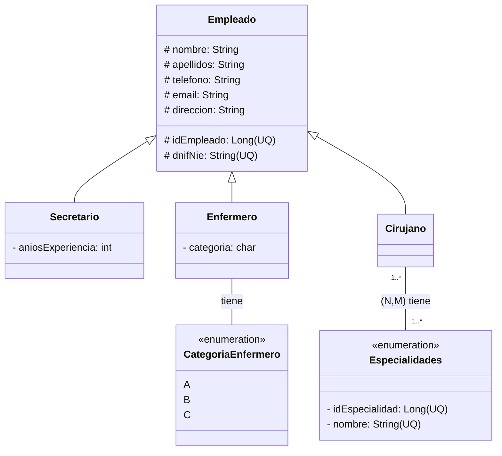

# Diagrama de clases para empleados

```mermaid
classDiagram
    class Empleado {
        # idEmpleado: Long (UQ)
        # nombre: String
        # apellidos: String
        # telefono: String
        # email: String
        # dnifNie: String (UQ)
        # direccion: String
    }

    class Secretario {
        - aniosExperiencia: int
    }

    class Enfermero {
        - categoria: char
    }

    class Cirujano {
    
    }
    
    class Especialidades {
        <<enumeration>>
        - idEspecialidad: Long (UQ)
        - nombre: String (UQ)
    }
    
    class CategoriaEnfermero {
        <<enumeration>>
        A
        B
        C
    }

    Empleado <|-- Secretario
    Empleado <|-- Enfermero
    Empleado <|-- Cirujano
    Cirujano "1..*" -- "1..*" Especialidades : (N,M) tiene
    Enfermero -- CategoriaEnfermero : tiene
```
