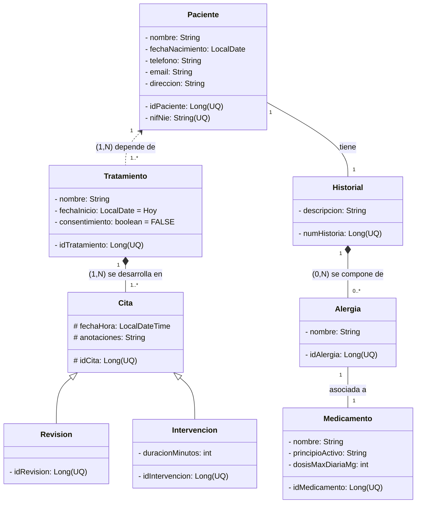

# Diagrama de clases para entidades

```mermaid
classDiagram
    class Paciente {
        - idPaciente: Long (UQ)
        - nombre: String
        - fechaNacimiento: LocalDate
        - telefono: String
        - email: String
        - direccion: String
        - nifNie: String (UQ)
    }

    class Tratamiento {
        - idTratamiento: Long (UQ)
        - nombre: String
        - fechaInicio: LocalDate = Hoy
        - consentimiento: boolean = FALSE
    }

    class Historial {
        - numHistoria: Long (UQ)
        - descripcion: String
    }

    class Alergia {
        - idAlergia: Long (UQ)
        - nombre: String
    }

    class Medicamento {
        - idMedicamento: Long (UQ)
        - nombre: String
        - principioActivo: String
        - dosisMaxDiariaMg: int
    }

    class Cita {
        # idCita: Long (UQ)
        # fechaHora: LocalDateTime
        # anotaciones: String
    }

    class Revision {
        - idRevision: Long (UQ)
    }

    class Intervencion {
        - idIntervencion: Long(UQ)   		
        - duracionMinutos: int
    }

    Paciente "1" <.. "1..*" Tratamiento : (1,N) depende de
    Paciente "1" -- "1" Historial : tiene
    Historial "1" *-- "0..*" Alergia : (0,N) se compone de
    Alergia "1" -- "1" Medicamento : asociada a
    Tratamiento "1" *-- "1..*" Cita : (1,N) se desarrolla en
    Cita <|-- Revision
    Cita <|-- Intervencion
```
